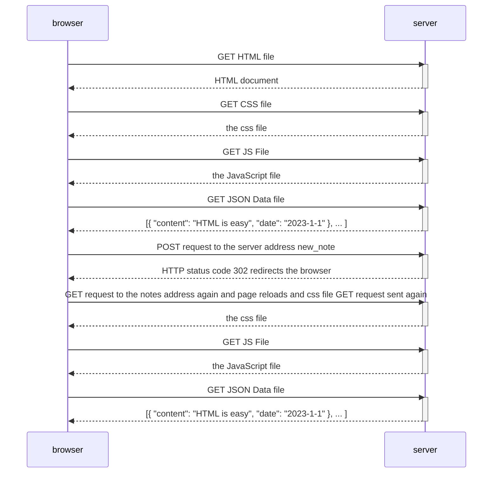

```mermaid
sequenceDiagram
    participant browser
    participant server

    browser->>server: GET HTML file
    activate server
    server-->>browser: HTML document
    deactivate server

    browser->>server: GET CSS file
    activate server
    server-->>browser: the css file
    deactivate server

    browser->>server: GET JS File
    activate server
    server-->>browser: the JavaScript file
    deactivate server

    browser->>server: GET JSON Data file
    activate server
    server-->>browser: [{ "content": "HTML is easy", "date": "2023-1-1" }, ... ]
    deactivate server

    browser->>server: POST request to the server address new_note
    activate server
    server-->>browser: HTTP status code 302 redirects the browser
    deactivate server

    browser->>server: GET request to the notes address again and page reloads and css file GET request sent again
    activate server
    server-->>browser: the css file
    deactivate server

    browser->>server: GET JS File
    activate server
    server-->>browser: the JavaScript file
    deactivate server

    browser->>server: GET JSON Data file
    activate server
    server-->>browser: [{ "content": "HTML is easy", "date": "2023-1-1" }, ... ]
    deactivate server

    
```